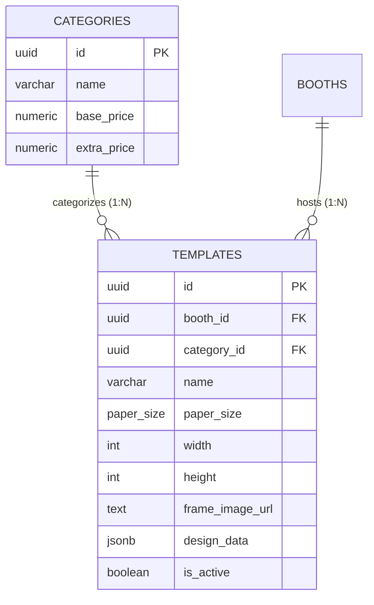

# 05. Frame Templates & Canvas Specification (`/api/booths/{boothId}/templates`)

## 1. Overview & Conceptual Model

Modul **Frame Templates** mengelola desain bingkai foto kustom, dimensi canvas, ukuran kertas cetak, dan koordinat layer slot foto untuk visual rendering engine.

### 1.1 Relasi ke Kategori Frame (`Category`)
- Setiap Template terhubung ke **tepat 1 Kategori** melalui foreign key `category_id` (`templates.category_id REFERENCES categories(id)`).
- Satu Kategori dapat memiliki **banyak Template** (Relasi *One-to-Many* / 1:N).
- Saat booth client memuat kategori, template yang sesuai dapat difilter secara spesifik menggunakan query parameter `?category_id={uuid}`.



- **Base Path**: `/api/booths/{boothId}/templates`
- **Security**: Bearer JWT (`Owner` / `SuperAdmin` untuk mutasi data, authenticated read access untuk stasiun booth).

---

## 2. Paper Size & Dimension Types

Template frame mendukung ukuran standar percetakan foto serta ukuran kustom (*Custom Dimension*):

| Paper Size Enum | Nilai Payload | Deskripsi Rasio / Dimensi Standar |
|---|---|---|
| `FourR` | `"4R"` (alias `"four_r"`) | 4x6 inch (1200 x 1800 px pada 300 DPI) |
| `SixByEight` | `"6x8"` (alias `"six_by_eight"`) | 6x8 inch / 4R Landscape (1800 x 1200 px) |
| `TwoBySix` | `"2x6"` (alias `"two_by_six"`) | 2x6 inch Photo Strip (600 x 1800 px) |
| `SixBySix` | `"6x6"` (alias `"six_by_six"`) | 6x6 inch Square 1:1 (1800 x 1800 px) |
| `Custom` | `"custom"` | Ukuran kustom dengan lebar (`width`) dan tinggi (`height`) bebas |

---

## 3. Struktur Data Layer (`design_data`)

Array objek JSON yang mendefinisikan layer slot foto dan elemen visual:

| Field | Tipe | Wajib | Deskripsi |
|---|---|---|---|
| `id` | `integer` / `string` | Tidak | Identifier layer |
| `name` | `string` | Tidak | Label layer (contoh: `"Photo Slot 1"`) |
| `x` | `integer` | **Ya** | Posisi koordinat horizontal (X) dari kiri |
| `y` | `integer` | **Ya** | Posisi koordinat vertikal (Y) dari atas |
| `w` | `integer` | **Ya** | Lebar layer (*width*) dalam pixel |
| `h` | `integer` | **Ya** | Tinggi layer (*height*) dalam pixel |
| `rot` | `integer` | Tidak | Sudut rotasi layer (derajat, misal 0, 90, 180, 270) |
| `visible` | `boolean` | Tidak | Visibilitas layer (default: `true`) |
| `locked` | `boolean` | Tidak | Status terkunci pada canvas editor |
| `chromaKey` | `boolean` | Tidak | Mengaktifkan filter green/blue screen |
| `printSecondary` | `boolean` | Tidak | Pengaturan pencetakan duplikat pada strip |

---

## 4. Spesifikasi Endpoint REST

### 4.1 List Templates (`GET /api/booths/{boothId}/templates`)

Mengambil daftar template untuk booth tertentu dengan filter opsional berdasarkan `category_id` dan `is_active`.

- **Method**: `GET`
- **Endpoint**: `/api/booths/{boothId}/templates`
- **Query Parameters**:
  - `category_id` (opsional): UUID kategori untuk filter template
  - `is_active` (opsional): Filter status aktif (`true` / `false`)
- **Auth Required**: Yes (`Bearer <token>`)

#### Response Success (`200 OK`)
```json
[
  {
    "id": "t1111111-1111-1111-1111-111111111111",
    "booth_id": "01928374-aaaa-bbbb-cccc-112233445566",
    "category_id": "c1111111-2222-3333-4444-555555555555",
    "name": "Classic Strip 3-Photo",
    "description": "3-photo strip frame design",
    "paper_size": "2x6",
    "width": 600,
    "height": 1800,
    "frame_image_url": "https://pub-r2.potohub.com/frames/classic_strip.png",
    "design_data": [
      {
        "id": 1,
        "name": "Photo Slot 1",
        "x": 50,
        "y": 80,
        "w": 500,
        "h": 450,
        "rot": 0,
        "visible": true,
        "locked": false,
        "chromaKey": false,
        "printSecondary": false
      },
      {
        "id": 2,
        "name": "Photo Slot 2",
        "x": 50,
        "y": 560,
        "w": 500,
        "h": 450,
        "rot": 0,
        "visible": true,
        "locked": false,
        "chromaKey": false,
        "printSecondary": false
      },
      {
        "id": 3,
        "name": "Photo Slot 3",
        "x": 50,
        "y": 1040,
        "w": 500,
        "h": 450,
        "rot": 0,
        "visible": true,
        "locked": false,
        "chromaKey": false,
        "printSecondary": false
      }
    ],
    "is_active": true,
    "created_at": "2026-07-26T05:20:00Z",
    "updated_at": "2026-07-26T05:20:00Z"
  }
]
```

---

### 4.2 Create Frame Template (`POST /api/booths/{boothId}/templates`)

Membuat template baru yang wajib terhubung ke suatu `category_id`.

- **Method**: `POST`
- **Endpoint**: `/api/booths/{boothId}/templates`
- **Auth Required**: Yes (`Owner` / `SuperAdmin`)

#### Request Body
```json
{
  "category_id": "c1111111-2222-3333-4444-555555555555",
  "name": "Custom Square 4-Grid",
  "description": "Square frame design with 4 grid photo slots",
  "paper_size": "custom",
  "width": 1500,
  "height": 1500,
  "frame_image_url": "https://pub-r2.potohub.com/frames/square_grid.png",
  "design_data": [
    {
      "id": 1,
      "name": "Slot Top Left",
      "x": 50,
      "y": 50,
      "w": 680,
      "h": 680,
      "rot": 0,
      "visible": true,
      "locked": false,
      "chromaKey": false,
      "printSecondary": false
    },
    {
      "id": 2,
      "name": "Slot Top Right",
      "x": 770,
      "y": 50,
      "w": 680,
      "h": 680,
      "rot": 0,
      "visible": true,
      "locked": false,
      "chromaKey": false,
      "printSecondary": false
    }
  ]
}
```

#### Response Success (`201 Created`)
```json
{
  "id": "01928374-8888-7777-6666-555544443333",
  "booth_id": "01928374-aaaa-bbbb-cccc-112233445566",
  "category_id": "c1111111-2222-3333-4444-555555555555",
  "name": "Custom Square 4-Grid",
  "description": "Square frame design with 4 grid photo slots",
  "paper_size": "custom",
  "width": 1500,
  "height": 1500,
  "frame_image_url": "https://pub-r2.potohub.com/frames/square_grid.png",
  "design_data": [ ... ],
  "is_active": true,
  "created_at": "2026-08-21T00:00:00Z",
  "updated_at": "2026-08-21T00:00:00Z"
}
```

---

### 4.3 Get Template Details (`GET /api/booths/{boothId}/templates/{id}`)

- **Method**: `GET`
- **Endpoint**: `/api/booths/{boothId}/templates/{id}`
- **Auth Required**: Yes

#### Response Success (`200 OK`)
```json
{
  "id": "01928374-8888-7777-6666-555544443333",
  "booth_id": "01928374-aaaa-bbbb-cccc-112233445566",
  "category_id": "c1111111-2222-3333-4444-555555555555",
  "name": "Custom Square 4-Grid",
  "description": "Square frame design with 4 grid photo slots",
  "paper_size": "custom",
  "width": 1500,
  "height": 1500,
  "frame_image_url": "https://pub-r2.potohub.com/frames/square_grid.png",
  "design_data": [ ... ],
  "is_active": true,
  "created_at": "2026-08-21T00:00:00Z",
  "updated_at": "2026-08-21T00:00:00Z"
}
```

---

### 4.4 Update Template (`PUT /api/booths/{boothId}/templates/{id}`)

Memperbarui atribut template, termasuk memindahkan template ke `category_id` lain.

- **Method**: `PUT`
- **Endpoint**: `/api/booths/{boothId}/templates/{id}`
- **Auth Required**: Yes (`Owner` / `SuperAdmin`)

#### Request Body
```json
{
  "category_id": "c2222222-2222-3333-4444-555555555555",
  "name": "Custom Square 4-Grid Updated",
  "is_active": true,
  "width": 1600,
  "height": 1600,
  "design_data": [
    {
      "id": 1,
      "name": "Slot Top Left",
      "x": 60,
      "y": 60,
      "w": 700,
      "h": 700
    }
  ]
}
```

#### Response Success (`200 OK`)
```json
{
  "id": "01928374-8888-7777-6666-555544443333",
  "booth_id": "01928374-aaaa-bbbb-cccc-112233445566",
  "category_id": "c2222222-2222-3333-4444-555555555555",
  "name": "Custom Square 4-Grid Updated",
  "description": "Square frame design with 4 grid photo slots",
  "paper_size": "custom",
  "width": 1600,
  "height": 1600,
  "frame_image_url": "https://pub-r2.potohub.com/frames/square_grid.png",
  "design_data": [ ... ],
  "is_active": true,
  "created_at": "2026-08-21T00:00:00Z",
  "updated_at": "2026-08-21T00:10:00Z"
}
```

---

### 4.5 Delete Template (`DELETE /api/booths/{boothId}/templates/{id}`)

Menghapus template frame dari booth.

- **Method**: `DELETE`
- **Endpoint**: `/api/booths/{boothId}/templates/{id}`
- **Auth Required**: Yes (`Owner` / `SuperAdmin`)

#### Response Success (`200 OK`)
```json
{
  "message": "Template deleted successfully"
}
```
