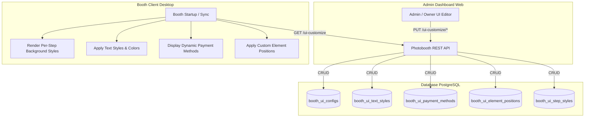

# 16. UI Customization Specification (`/api/booths/{boothId}/ui-customize`)

## 1. Overview & Architecture

Fitur **UI Customization** memungkinkan pemilik photobooth (*Owner*) untuk menyesuaikan tampilan visual (*look and feel*) antarmuka aplikasi **Booth Client** (Tauri Desktop App) secara dinamis per-step dari **Admin Dashboard** (Web). 

Setiap booth fisik dapat memiliki tema visual unik per-step yang disesuaikan dengan merek, lokasi mall, tema acara, atau kolaborasi khusus tanpa memerlukan kompilasi ulang pada aplikasi desktop.



- **Base Path**: `/api/booths/{boothId}/ui-customize`
- **Security**: Bearer JWT Token (`Authorization: Bearer <token>`).
- **Authorization**: Endpoint pembacaan (`GET`) dapat diakses oleh user terautentikasi dan token booth client. Endpoint manipulasi (`PUT`, `POST`, `DELETE`) membutuhkan hak akses `Owner` atau `SuperAdmin`.

> [!WARNING]
> **Breaking Change**: Endpoint background level-booth global `PUT /api/booths/{boothId}/ui-customize/background` dan kolom `bg_type/bg_value/image_asset_id` pada `booth_ui_configs` telah **DIHAPUS**. Kustomisasi background sekarang dikelola per-step via `/api/booths/{boothId}/ui-customize/step-styles`.

---

## 2. Model Data & Konsep Desain

### 2.1 Konfigurasi Umum (`BoothUIConfig`)
Menyimpan konfigurasi umum level-booth seperti nama booth, tagline, video tutorial, dan varian template.

| Atribut | Tipe | Default | Deskripsi |
|---|---|---|---|
| `id` | `UUID` | UUID v7 | Identifier unik konfigurasi UI |
| `booth_id` | `UUID` | - | Relasi unik 1-to-1 ke tabel `booths` |
| `booth_name` | `VARCHAR(50)` | `"OUR PICS"` | Nama atau judul booth utama di Start Screen |
| `tagline` | `VARCHAR(100)` | `"tell a story"` | Subtitle / slogan di bawah nama booth |
| `tutorial_asset_id` | `UUID` | `NULL` | Foreign key ke `assets.id` untuk video/gambar tutorial |
| `template_variant` | `ui_client_variant` | `'v1'` | Varian layout UI client (`'v1'`, `'v2'`, `'v3'`) |
| `created_at` | `TIMESTAMPTZ` | `NOW()` | Timestamp pembuatan |
| `updated_at` | `TIMESTAMPTZ` | `NOW()` | Timestamp modifikasi terakhir |

---

### 2.2 Background Per-Step (`BoothUIStepStyle`)
Latar belakang (*background*) dikustomisasi secara spesifik per **step** alur UI booth client (`start`, `tutorial`, `package`, `payment`, `ticket`, `frame`, `session`, `filter`, `loading`, `download`, `softfile`).

| Atribut | Tipe | Default | Deskripsi |
|---|---|---|---|
| `id` | `UUID` | UUID v7 | Identifier gaya step |
| `booth_id` | `UUID` | - | Relasi ke booth |
| `step` | `ui_step` | - | Enum step UI booth client |
| `bg_type` | `ui_background_type` | `'none'` | `'color'`, `'gradient'`, `'image'`, atau `'none'` |
| `bg_value` | `TEXT` | `NULL` | Kode warna HEX (misal `#1A1A1A`), formula CSS Gradient, atau Public URL Gambar R2 CDN |
| `image_asset_id` | `UUID` | `NULL` | Foreign key ke `assets.id` (legacy) |
| `updated_at` | `TIMESTAMPTZ` | `NOW()` | Timestamp pembaruan |

#### Opsi Nilai Background:
1. **None / Default (`none`)**: Background di-reset / tidak diatur. Komponen menggunakan background transparan / default layout.
2. **Solid Color (`color`)**: Kode warna hex standar (contoh: `#0F172A`, `#FFFFFF`).
3. **CSS Gradient (`gradient`)**: Format CSS gradient standar (contoh: `linear-gradient(135deg, #1f1c2c 0%, #928dab 100%)`).
4. **Custom Image (`image`)**: Public URL Cloudflare R2 CDN gambar latar belakang (contoh: `https://pub-xxx.r2.dev/org_id/booth_id/ui-customize/step-backgrounds/start_1700000000.jpg`).

---

### 2.3 Gaya Tipografi Elemen (`BoothUITextStyle`)
Memungkinkan penyesuaian gaya teks spesifik untuk setiap komponen UI kunci pada booth client.

| Atribut | Tipe | Deskripsi |
|---|---|---|
| `id` | `UUID` | Identifier gaya teks |
| `booth_id` | `UUID` | Relasi ke booth |
| `element_key` | `VARCHAR(50)` | Kunci elemen (`booth_name`, `tagline`, `payment_title`, `frame_title`, `softfile_title`, `softfile_subtitle`, dll) |
| `font_size` | `ui_text_size` | `'kecil'` (Small), `'sedang'` (Medium), `'besar'` (Large) |
| `font_family` | `ui_text_font` | `'sans_serif'`, `'serif'`, `'monospace'` |
| `color` | `VARCHAR(20)` | Format HEX atau RGBA (misal: `#FFCC00`, `rgba(255,255,255,0.9)`) |
| `updated_at` | `TIMESTAMPTZ` | Timestamp pembaruan |

---

### 2.4 Daftar Metode Pembayaran UI (`BoothUIPaymentMethod`)
Mengontrol opsi pembayaran apa saja yang muncul di layar pembayaran booth client beserta logo dan urutan tampilannya.

| Atribut | Tipe | Deskripsi |
|---|---|---|
| `id` | `UUID` | Identifier metode pembayaran |
| `booth_id` | `UUID` | Relasi ke booth |
| `name` | `VARCHAR(50)` | Nama metode (contoh: `"QRIS"`, `"Voucher Promo"`, `"Cash"`) |
| `logo_asset_id` | `UUID` | Referensi ikon/logo ke `assets.id` |
| `position` | `INT` | Urutan indeks urutan tampilan (0, 1, 2, ...) |
| `is_active` | `BOOLEAN` | Status aktif/tampil di client |
| `created_at` | `TIMESTAMPTZ` | Timestamp pembuatan |
| `updated_at` | `TIMESTAMPTZ` | Timestamp pembaruan |

---

### 2.5 Posisi Elemen — Drag & Drop (`BoothUIElementPosition`)
Menyimpan posisi koordinat visual (anchor: center, persentase 0.0–100.0) per elemen dan layar.

| Atribut | Tipe | Deskripsi |
|---|---|---|
| `id` | `UUID` | Identifier posisi elemen |
| `booth_id` | `UUID` | Relasi ke booth |
| `screen_key` | `VARCHAR(50)` | Kunci layar (contoh: `"start"`) |
| `element_key` | `VARCHAR(50)` | Kunci elemen (contoh: `"start_button"`) |
| `x_percent` | `DOUBLE` | Posisi horizontal persentase (0.0 - 100.0, default 50.0) |
| `y_percent` | `DOUBLE` | Posisi vertikal persentase (0.0 - 100.0, default 80.0) |
| `snapped_h` | `BOOLEAN` | Metadata snapping guideline horizontal |
| `snapped_v` | `BOOLEAN` | Metadata snapping guideline vertikal |
| `updated_at` | `TIMESTAMPTZ` | Timestamp pembaruan |

---

## 3. Spesifikasi Endpoint REST

### 3.1 Get Full UI Configuration (`GET /api/booths/{boothId}/ui-customize`)

Mengambil seluruh paket konfigurasi UI booth dalam satu payload agregat untuk inisialisasi cepat saat booth client dinyalakan.

- **Method**: `GET`
- **Endpoint**: `/api/booths/{boothId}/ui-customize`
- **Auth Required**: Yes (`Bearer <token>`)

#### Response Success (`200 OK`)
```json
{
  "general": {
    "id": "01928374-1111-7777-8888-999999999999",
    "booth_id": "01928374-aaaa-bbbb-cccc-112233445566",
    "booth_name": "OUR PICS",
    "tagline": "tell a story",
    "tutorial_asset_id": null,
    "template_variant": "v1",
    "created_at": "2026-08-21T00:00:00Z",
    "updated_at": "2026-08-21T00:00:00Z"
  },
  "text_styles": [
    {
      "id": "01928374-2222-7777-8888-999999999999",
      "booth_id": "01928374-aaaa-bbbb-cccc-112233445566",
      "element_key": "booth_name",
      "font_size": "besar",
      "font_family": "sans_serif",
      "color": "#FFFFFF",
      "updated_at": "2026-08-21T00:00:00Z"
    }
  ],
  "payment_methods": [],
  "element_positions": [],
  "step_styles": [
    {
      "id": "0199a2e0-3333-7777-8888-999999999999",
      "booth_id": "01928374-aaaa-bbbb-cccc-112233445566",
      "step": "frame",
      "bg_type": "gradient",
      "bg_value": "linear-gradient(135deg,#1e1b4b 0%,#312e81 100%)",
      "image_asset_id": null,
      "updated_at": "2026-09-01T00:00:00Z"
    }
  ]
}
```

---

### 3.2 Update General UI Configuration (`PUT /api/booths/{boothId}/ui-customize/general`)

Memperbarui informasi nama booth, tagline, video tutorial, dan varian template.

- **Method**: `PUT`
- **Endpoint**: `/api/booths/{boothId}/ui-customize/general`
- **Auth Required**: Yes (`Owner` / `SuperAdmin`)

#### Request Body
```json
{
  "booth_name": "FOTOPIC STUDIO MALL",
  "tagline": "Capture Your Best Moment",
  "tutorial_asset_id": "01928374-aaaa-7777-8888-112233445566",
  "template_variant": "v2"
}
```

#### Response Success (`200 OK`)
```json
{
  "id": "01928374-1111-7777-8888-999999999999",
  "booth_id": "01928374-aaaa-bbbb-cccc-112233445566",
  "booth_name": "FOTOPIC STUDIO MALL",
  "tagline": "Capture Your Best Moment",
  "tutorial_asset_id": "01928374-aaaa-7777-8888-112233445566",
  "template_variant": "v2",
  "created_at": "2026-08-21T00:00:00Z",
  "updated_at": "2026-08-21T00:05:00Z"
}
```

---

### 3.3 Step Styles Endpoints (`/ui-customize/step-styles`)

#### 3.3.1 List Step Styles (`GET /api/booths/{boothId}/ui-customize/step-styles`)
- **Method**: `GET`
- **Endpoint**: `/api/booths/{boothId}/ui-customize/step-styles`
- **Auth Required**: Yes (`Bearer <token>`)

#### 3.3.2 Request Step Background Upload Presigned URL (`POST /api/booths/{boothId}/ui-customize/step-styles/upload-url`)
Mendapatkan presigned PUT URL R2 Object Storage untuk mengunggah gambar background step langsung dari browser/frontend.

- **Method**: `POST`
- **Endpoint**: `/api/booths/{boothId}/ui-customize/step-styles/upload-url`
- **Auth Required**: Yes (`Owner` / `SuperAdmin`)

##### Request Body
```json
{
  "step": "start",
  "file_extension": "jpg",
  "content_type": "image/jpeg"
}
```

##### Response Success (`200 OK`)
```json
{
  "upload_url": "https://<bucket>.<r2-account>.r2.cloudflarestorage.com/org_id/booth_id/ui-customize/step-backgrounds/start_1700000000000.jpg?X-Amz-...",
  "public_url": "https://pub-xxx.r2.dev/org_id/booth_id/ui-customize/step-backgrounds/start_1700000000000.jpg",
  "object_key": "org_id/booth_id/ui-customize/step-backgrounds/start_1700000000000.jpg",
  "expires_in": 3600
}
```

#### 3.3.3 Update Step Style (`PUT /api/booths/{boothId}/ui-customize/step-styles/{step}`)
- **Method**: `PUT`
- **Endpoint**: `/api/booths/{boothId}/ui-customize/step-styles/{step}`
- **Path Parameter**: `step` (`start`, `tutorial`, `package`, `payment`, `ticket`, `frame`, `session`, `filter`, `loading`, `download`, `softfile`)
- **Auth Required**: Yes (`Owner` / `SuperAdmin`)

##### Request Body
```json
{
  "bg_type": "gradient",
  "bg_value": "linear-gradient(135deg,#1e1b4b 0%,#312e81 100%)"
}
```

##### Response Success (`200 OK`)
```json
{
  "id": "0199a2e0-3333-7777-8888-999999999999",
  "booth_id": "01928374-aaaa-bbbb-cccc-112233445566",
  "step": "frame",
  "bg_type": "gradient",
  "bg_value": "linear-gradient(135deg,#1e1b4b 0%,#312e81 100%)",
  "image_asset_id": null,
  "updated_at": "2026-09-01T00:00:00Z"
}
```

#### 3.3.3 Reset Step Style (`DELETE /api/booths/{boothId}/ui-customize/step-styles/{step}`)
Mengosongkan kustomisasi background step kembali ke default (`bg_type: none`).

- **Method**: `DELETE`
- **Endpoint**: `/api/booths/{boothId}/ui-customize/step-styles/{step}`
- **Auth Required**: Yes (`Owner` / `SuperAdmin`)

##### Response Success (`200 OK`)
```json
{
  "message": "Gaya step di-reset ke default"
}
```

---

### 3.4 Get Public UI Configuration (`GET /api/booths/{boothId}/ui-customize/public`)

Endpoint publik read-only khusus dikonsumsi Booth Client (desktop app) setelah activation-code login dan tombol Sync di panel konfigurasi booth.

- **Method**: `GET`
- **Endpoint**: `/api/booths/{boothId}/ui-customize/public`
- **Auth Required**: No

#### Response Success (`200 OK`)
```json
{
  "booth_id": "01928374-aaaa-bbbb-cccc-112233445566",
  "template_variant": "v1",
  "general": {
    "id": "01928374-1111-7777-8888-999999999999",
    "booth_id": "01928374-aaaa-bbbb-cccc-112233445566",
    "booth_name": "OUR PICS",
    "tagline": "tell a story",
    "tutorial_asset_id": null,
    "template_variant": "v1",
    "created_at": "2026-08-21T00:00:00Z",
    "updated_at": "2026-08-21T00:00:00Z"
  },
  "text_styles": [],
  "payment_methods": [],
  "element_positions": [],
  "step_styles": []
}
```
