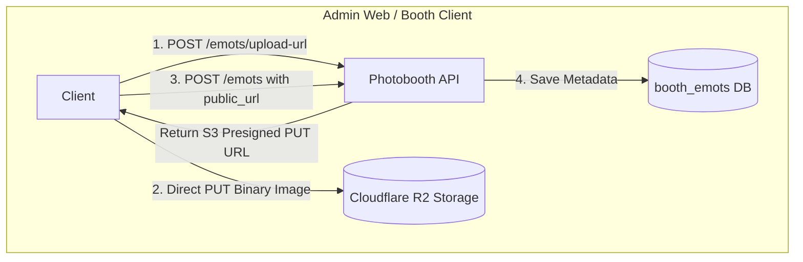

# 17. Booth Emots & Stickers Specification (`/api/booths/{boothId}/emots`)

## 1. Overview & Conceptual Model

Modul **Emots & Stickers** memungkinkan pengelolaan koleksi emotikon dan stiker visual per stasiun photobooth (`booth_id`). Stiker ini digunakan oleh pelanggan pada layar editing/dekorasi foto di aplikasi **Booth Client** (Tauri Desktop App) sebelum foto dicetak atau dikirim via softfile.

Fitur ini mendukung 3 jenis sumber emot:
1. **Emoji Teks / Unicode (`emoji`)**: Karakter emoji unicode atau simbol (contoh: `"😎"`, `"❤️"`, `"✨"`).
2. **File Gambar Cloudflare R2 (`image`)**: Stiker transparan (PNG/SVG/WebP) yang diunggah langsung ke Cloudflare R2 menggunakan S3 Presigned Upload URL.
3. **URL Gambar Eksternal (`image`)**: Tautan langsung ke gambar yang dihosting di server eksternal.



- **Base Path**: `/api/booths/{boothId}/emots`
- **Security**: Public / Booth Client untuk pembacaan (`GET`), Bearer JWT (`Owner` / `SuperAdmin`) untuk penulisan.
- **Authorization**: Endpoint pembacaan (`GET`) dapat diakses secara publik oleh Booth Client dan user terautentikasi. Endpoint penulisan (`POST`, `PUT`, `DELETE`) memerlukan hak akses `Owner` atau `SuperAdmin`.

---

## 2. Struktur Data Database (`booth_emots`)

| Atribut | Tipe | Default | Deskripsi |
|---|---|---|---|
| `id` | `UUID` | UUID v7 | Identifier unik emot/stiker |
| `booth_id` | `UUID` | - | Relasi foreign key ke tabel `booths(id)` (CASCADE) |
| `name` | `VARCHAR(100)` | - | Nama label emot/stiker (contoh: `"Cool Sunglasses"`) |
| `emot_type` | `emot_type` | `'emoji'` | Tipe emot: `'emoji'` atau `'image'` |
| `emoji_text` | `VARCHAR(30)` | `NULL` | Karakter unicode emoji jika `emot_type = 'emoji'` |
| `file_url` | `TEXT` | `NULL` | URL file gambar jika `emot_type = 'image'` |
| `asset_id` | `UUID` | `NULL` | Relasi opsional ke tabel `assets(id)` |
| `category` | `VARCHAR(50)` | `'general'` | Pengelompokan stiker (contoh: `'smileys'`, `'party'`, `'decorations'`) |
| `position` | `INT` | `0` | Urutan indeks tampilan pada picker booth client |
| `is_active` | `BOOLEAN` | `TRUE` | Status aktif (tampil pada client) |
| `created_at` | `TIMESTAMPTZ` | `NOW()` | Timestamp pembuatan |
| `updated_at` | `TIMESTAMPTZ` | `NOW()` | Timestamp modifikasi terakhir |

---

## 3. Spesifikasi Endpoint REST

### 3.1 List Emots & Stickers (`GET /api/booths/{boothId}/emots`)

Mengambil daftar emot dan stiker untuk booth tertentu dengan dukungan filter kategori, tipe, dan status aktif.

- **Method**: `GET`
- **Endpoint**: `/api/booths/{boothId}/emots`
- **Auth Required**: No (Public / Booth Client)
- **Query Parameters**:
  - `category` (opsional): Filter kategori (misal: `smileys`, `party`)
  - `emot_type` (opsional): Filter tipe (`emoji` atau `image`)
  - `is_active` (opsional): Filter boolean (`true` / `false`)

#### Response Success (`200 OK`)
```json
[
  {
    "id": "01928374-1111-7777-8888-000000000001",
    "booth_id": "01928374-aaaa-bbbb-cccc-112233445566",
    "name": "Sunglasses Cool",
    "emot_type": "emoji",
    "emoji_text": "😎",
    "file_url": null,
    "asset_id": null,
    "category": "smileys",
    "position": 0,
    "is_active": true,
    "created_at": "2026-08-21T00:45:00Z",
    "updated_at": "2026-08-21T00:45:00Z"
  },
  {
    "id": "01928374-1111-7777-8888-000000000002",
    "booth_id": "01928374-aaaa-bbbb-cccc-112233445566",
    "name": "Party Hat Sticker",
    "emot_type": "image",
    "emoji_text": null,
    "file_url": "https://pub-r2.potohub.com/org-id/booth-id/emots/party_hat.png",
    "asset_id": null,
    "category": "party",
    "position": 1,
    "is_active": true,
    "created_at": "2026-08-21T00:45:00Z",
    "updated_at": "2026-08-21T00:45:00Z"
  }
]
```

---

### 3.2 Request Presigned Upload URL R2 (`POST /api/booths/{boothId}/emots/upload-url`)

Menghasilkan S3 Presigned PUT URL agar browser/desktop client dapat mengunggah file gambar stiker langsung ke Cloudflare R2 tanpa membebani server backend.

- **Method**: `POST`
- **Endpoint**: `/api/booths/{boothId}/emots/upload-url`
- **Auth Required**: Yes (`Owner` / `SuperAdmin`)

#### Request Body
```json
{
  "file_extension": "png",
  "content_type": "image/png"
}
```

#### Response Success (`200 OK`)
```json
{
  "upload_url": "https://<account-id>.r2.cloudflarestorage.com/potohub-bucket/org-uuid/booth-uuid/emots/01928374_1771635000.png?X-Amz-Signature=...",
  "public_url": "https://pub-r2.potohub.com/org-uuid/booth-uuid/emots/01928374_1771635000.png",
  "file_key": "org-uuid/booth-uuid/emots/01928374_1771635000.png",
  "expires_in_secs": 900
}
```

---

### 3.3 Create Emot / Sticker (`POST /api/booths/{boothId}/emots`)

Menyimpan metadata emot baru (baik emoji teks, URL upload R2, maupun URL gambar eksternal).

- **Method**: `POST`
- **Endpoint**: `/api/booths/{boothId}/emots`
- **Auth Required**: Yes (`Owner` / `SuperAdmin`)

#### Request Body (Contoh 1: Emoji Teks)
```json
{
  "name": "Sparkles",
  "emot_type": "emoji",
  "emoji_text": "✨",
  "category": "decorations"
}
```

#### Request Body (Contoh 2: File Gambar R2 / Eksternal)
```json
{
  "name": "Cat Ears Headband",
  "emot_type": "image",
  "file_url": "https://pub-r2.potohub.com/org-uuid/booth-uuid/emots/cat_ears.png",
  "category": "decorations",
  "position": 5,
  "is_active": true
}
```

#### Response Success (`201 Created`)
```json
{
  "id": "01928374-1111-7777-8888-000000000003",
  "booth_id": "01928374-aaaa-bbbb-cccc-112233445566",
  "name": "Cat Ears Headband",
  "emot_type": "image",
  "emoji_text": null,
  "file_url": "https://pub-r2.potohub.com/org-uuid/booth-uuid/emots/cat_ears.png",
  "asset_id": null,
  "category": "decorations",
  "position": 5,
  "is_active": true,
  "created_at": "2026-08-21T00:46:00Z",
  "updated_at": "2026-08-21T00:46:00Z"
}
```

---

### 3.4 Get Emot Detail (`GET /api/booths/{boothId}/emots/{id}`)

- **Method**: `GET`
- **Endpoint**: `/api/booths/{boothId}/emots/{id}`
- **Auth Required**: Yes

#### Response Success (`200 OK`)
```json
{
  "id": "01928374-1111-7777-8888-000000000003",
  "booth_id": "01928374-aaaa-bbbb-cccc-112233445566",
  "name": "Cat Ears Headband",
  "emot_type": "image",
  "emoji_text": null,
  "file_url": "https://pub-r2.potohub.com/org-uuid/booth-uuid/emots/cat_ears.png",
  "asset_id": null,
  "category": "decorations",
  "position": 5,
  "is_active": true,
  "created_at": "2026-08-21T00:46:00Z",
  "updated_at": "2026-08-21T00:46:00Z"
}
```

---

### 3.5 Update Emot (`PUT /api/booths/{boothId}/emots/{id}`)

Memperbarui nama, kategori, posisi urutan, status aktif, atau konten gambar/emoji.

- **Method**: `PUT`
- **Endpoint**: `/api/booths/{boothId}/emots/{id}`
- **Auth Required**: Yes (`Owner` / `SuperAdmin`)

#### Request Body
```json
{
  "name": "Cat Ears Headband Gold Edition",
  "category": "party",
  "position": 2,
  "is_active": true
}
```

#### Response Success (`200 OK`)
```json
{
  "id": "01928374-1111-7777-8888-000000000003",
  "booth_id": "01928374-aaaa-bbbb-cccc-112233445566",
  "name": "Cat Ears Headband Gold Edition",
  "emot_type": "image",
  "emoji_text": null,
  "file_url": "https://pub-r2.potohub.com/org-uuid/booth-uuid/emots/cat_ears.png",
  "asset_id": null,
  "category": "party",
  "position": 2,
  "is_active": true,
  "created_at": "2026-08-21T00:46:00Z",
  "updated_at": "2026-08-21T00:48:00Z"
}
```

---

### 3.6 Delete Emot (`DELETE /api/booths/{boothId}/emots/{id}`)

Menghapus emot/stiker dari booth.

- **Method**: `DELETE`
- **Endpoint**: `/api/booths/{boothId}/emots/{id}`
- **Auth Required**: Yes (`Owner` / `SuperAdmin`)

#### Response Success (`200 OK`)
```json
{
  "message": "Emot deleted successfully"
}
```
